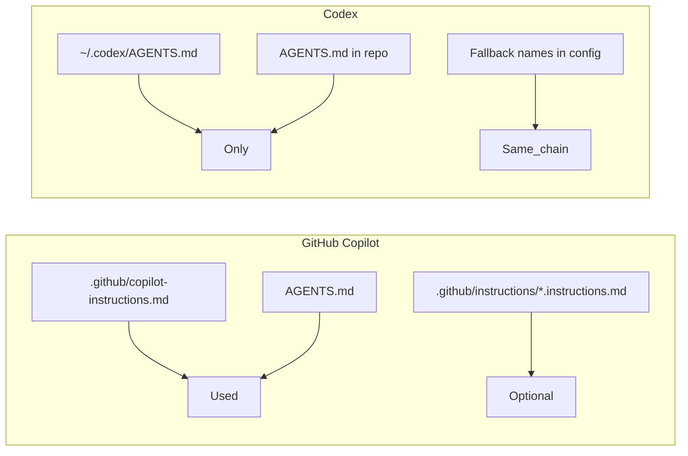

# Codex and Copilot: imposing rules aside from AGENTS.md

## Current extension behavior

| Platform    | Where rules live today                                                                                                                                                                                                                                                                                     | Role of AGENTS.md                                                                                                       |
| ----------- | ---------------------------------------------------------------------------------------------------------------------------------------------------------------------------------------------------------------------------------------------------------------------------------------------------------- | ----------------------------------------------------------------------------------------------------------------------- |
| **Codex**   | User: `~/.codex/AGENTS.md` (compounding cycle only). Workspace: `AGENTS.md` (rules + agent summaries from [codex.ts](src/adapters/codex.ts) `buildAgentsMd`).                                                                                                                                              | Only mechanism: global + project `AGENTS.md` are the instruction chain.                                                 |
| **Copilot** | Repo: [.github/copilot-instructions.md](src/adapters/copilot.ts) (rules + agent roles via `buildInstructionsMd`). User: VS Code/Cursor **prompts** folder as `plan-code-review-workflow.instructions.md` with `applyTo: "**"`. AGENTS.md: compounding cycle + custom agents reference via `buildAgentsMd`. | One of several instruction sources; Copilot also uses `.github/copilot-instructions.md` and path-specific instructions. |

So for **Copilot**, rules are already imposed mainly via **.github/copilot-instructions.md**, not only via AGENTS.md. For **Codex**, rules are imposed only via AGENTS.md (we use both user and workspace AGENTS.md).

---

## GitHub Copilot: how to impose rules (official docs)

**Source:** [Adding repository custom instructions for GitHub Copilot](https://docs.github.com/en/copilot/customizing-copilot/adding-custom-instructions-for-github-copilot)

Copilot supports **three** instruction types:

1. **Repository-wide**
   - **File:** `.github/copilot-instructions.md`
   - **Effect:** Applies to all requests in the repo.
   - **Extension:** We already write rules + agent roles here.
2. **Path-specific**
   - **Files:** `.github/instructions/NAME.instructions.md` (must end with `.instructions.md`).
   - **Frontmatter:** `applyTo: "glob"` (e.g. `"**"` for all files, `"**/*.ts"` for TypeScript). When a path matches, **both** repository-wide and matching path-specific instructions are used.
   - **Optional:** `excludeAgent: "code-review"` or `"coding-agent"` to limit which product reads the file.
   - **Extension:** We add `.github/instructions/compounding-dev-cycle.instructions.md` with `applyTo: "**"` so the cycle is a dedicated rules file and still applied everywhere.
3. **Agent instructions**
   - **Files:** `AGENTS.md`, `CLAUDE.md`, or `GEMINI.md` anywhere in the repo; **nearest file in the directory tree** wins.
   - **Extension:** We write root `AGENTS.md` with the cycle reference and custom agents.

**Conclusion for Copilot:** Rules can be imposed **without** relying on AGENTS.md by using:

- **.github/copilot-instructions.md** (already in use for rules), and/or
- **.github/instructions/*.instructions.md** with `applyTo: "**"` for additional always-on rules.

AGENTS.md is optional for “rules” on Copilot; we use it to reinforce the cycle and point to custom agents.

---

## Codex: how to impose rules (official docs)

**Sources:** [Custom instructions with AGENTS.md](https://developers.openai.com/codex/guides/agents-md), [Customization](https://developers.openai.com/codex/concepts/customization)

Codex has **no separate “rules” folder or file type**. All persistent guidance is the **AGENTS.md instruction chain**:

1. **Discovery (precedence)**
   - **Global:** `~/.codex/AGENTS.override.md` or `~/.codex/AGENTS.md` (one file, lowest priority).
   - **Project:** From repo root down to current directory; in each directory: `AGENTS.override.md` then `AGENTS.md` then fallback names (see below). At most one file per directory; files are concatenated (closer = later = overrides).
   - **Limit:** Combined size cap (`project_doc_max_bytes`, default 32 KiB).
2. **Optional fallback filenames**
   - In `~/.codex/config.toml`: `project_doc_fallback_filenames = ["TEAM_GUIDE.md", "RULES.md", ...]`.
   - Codex then discovers **those names** in addition to `AGENTS.md` / `AGENTS.override.md` in each directory. So you could put rules in e.g. `RULES.md` in the repo and add `RULES.md` to the fallback list; it’s still the same instruction chain, not a separate “rules” system.

**Conclusion for Codex:** There is **no** way to impose rules “aside from” the AGENTS.md-style instruction chain. The only levers are:

- **AGENTS.md** (and optionally **AGENTS.override.md**) at global and project level (current approach), and/or
- **Fallback filenames** (e.g. `RULES.md`) so the same content can live in a differently named file — still part of the same chain and subject to the same size limit.

---

## Summary

| Question                                | Copilot                                                                                                                                                    | Codex                                                                                                                                                                                          |
| --------------------------------------- | ---------------------------------------------------------------------------------------------------------------------------------------------------------- | ---------------------------------------------------------------------------------------------------------------------------------------------------------------------------------------------- |
| Can we impose rules without AGENTS.md?  | **Yes.** Use `.github/copilot-instructions.md` (we do) and/or `.github/instructions/*.instructions.md` with `applyTo: "**"`.                              | **No.** Only the AGENTS.md instruction chain exists; “rules” must live in that chain (AGENTS.md or a fallback filename).                                                                       |
| What the extension could do differently | We add `.github/instructions/compounding-dev-cycle.instructions.md` with `applyTo: "**"`; AGENTS.md references it and custom agents.                       | No doc-supported alternative; keep current user + workspace AGENTS.md. Optionally document or generate a `RULES.md` + `project_doc_fallback_filenames` for users who want a separate filename. |

---

## Implementation notes

- **Copilot:** The Copilot adapter writes `.github/instructions/compounding-dev-cycle.instructions.md` (content from the compounding dev cycle rule, frontmatter `applyTo: "**"`). AGENTS.md references that file and lists custom agents.
- **Codex:** No doc-backed way to add a “rules” folder. We keep user + workspace AGENTS.md. README and DEV-GUIDE note that Codex only supports the AGENTS.md chain and optionally `project_doc_fallback_filenames` for an alternate filename (e.g. RULES.md).
